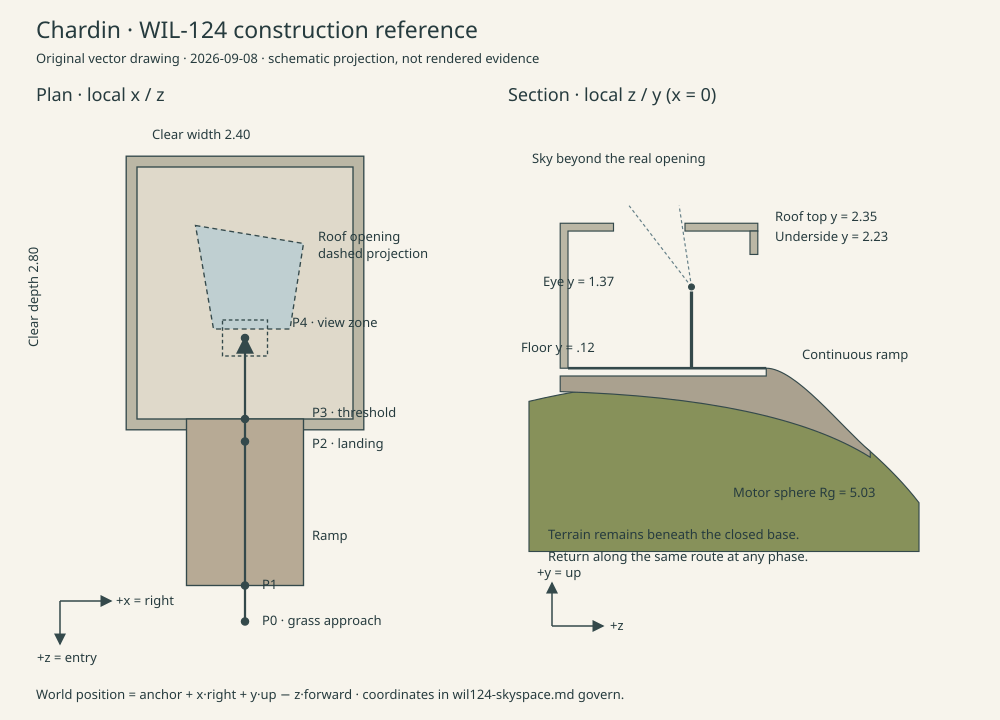

# WIL-124: Seamless skyspace design

## 1. Decision and approval

Design approved by the user's blanket **2026-09-08 approval**, explicitly recorded for the independently reviewed WIL-124 design PR. This authorizes this design; it does not assert that independent review, WIL-125 implementation, release gates, or deployment have passed. Independent spec and security/quality review must attach findings to the final diff. This delivery prepares repository artifacts only; no commit, push, PR creation, Linear/GitHub access, browser run, or deployment is authorized in this session. DNS and Vercel remain out of scope.

Source of acceptance: the user's WIL-124 request and the approved foundation plan, dated 2026-09-05, at `/home/hermes/.hermes/plans/2026-09-05_055912-chardin-world-foundation.md` (Wave 2 outline and acceptance direction). No remote issue text was retrieved. This document captures the decisions needed without that machine-local plan. Read the [acceptance and traceability contract](wil125-acceptance.md) next. Runtime source inspected at base `f3399b0ca8f05fe7082024d92443346cd95a8263`.

Select **one raised, level pavilion with a continuous approach ramp**, attached to the reserved Planet anchor. One scene, renderer, loop, route, and Traveler persist through entry and exit. A skewed quadrilateral roof opening frames a uniform authored sky; a matte interior surround changes slowly relative to it. The room is deliberately small enough to remain a Landmark on a visibly spherical Planet.

| Viable approach                          | Benefit                                                                 | Cost and disposition                                                                                                  |
| ---------------------------------------- | ----------------------------------------------------------------------- | --------------------------------------------------------------------------------------------------------------------- |
| Open ring following the spherical ground | Reuses radial locomotion; inexpensive and seamless                      | Curved floor and exposed horizon weaken chamber/threshold perception. Rejected for this brief.                        |
| Excavated chamber under the surface      | Low exterior silhouette; naturally sheltered                            | Requires terrain holes, inside/outside terrain handling and more collision complexity. Rejected for Wave 2.           |
| Raised tangent pavilion with ramp        | Level interior, continuous traversal, existing anchor and uncut terrain | Needs support-frame locomotion, a skirt and camera obstruction. **Selected**; bounded geometry solves these directly. |
| Portal or separate interior scene        | Arbitrarily large room and easy camera space                            | Breaks the approved seamless same-Planet relationship and adds rendering/lifecycle ownership. Rejected.               |

## 2. Surface frame and geometry

All dimensions are **world units**, not real-world metres. The existing Traveler is approximately 1.22 units tall; collision reserves height 1.30 and radius 0.35, independent of GLB nodes. Planet center is `C`; visual radius `R=5`; existing motor ground radius `Rg=5.03`. Do not scale the Planet or Traveler to fit the room.

Use `createLandmarkAnchor(C, R)` and its existing `LANDMARK_DIRECTION = normalize(0.72, 0.38, 0.58)`. Let `A=anchor.position`, `U=anchor.frame.up`, `X=anchor.frame.right`, `Z=-anchor.frame.forward`. The proper right-handed transform is `M=makeBasis(X,U,Z)` with translation `A`: `world(x,y,z)=A+xX+yU+zZ`; inverse coordinates are dot products with these axes after subtracting A. Heading is **0 radians relative to the existing frame**. Local +z is the entry side; travel inward is -z. Never use `makeBasis(right,up,forward)`, which reflects the mesh. Approximate audit values: `A=(3.60144,1.90076,2.90116)`, `U=(.72029,.38015,.58023)`, `X=(.46676,-.88438,0)`, `Z=(-.51315,-.27083,.81445)`; the formulas are authoritative.

The [SVG provenance record](wil124-assets.md#design-reference) identifies this original diagram. It is an orthographic construction reference, not a rendered approval screenshot. Diagram scale is illustrative; coordinates below govern.

| Part         | Local dimensions and placement                                                                                                                                                                                                                                                                                                                                        |
| ------------ | --------------------------------------------------------------------------------------------------------------------------------------------------------------------------------------------------------------------------------------------------------------------------------------------------------------------------------------------------------------------- |
| Chamber      | Clear floor `x=[-1.20,1.20]`, `z=[-1.40,1.40]`, top `y=.12`. Floor slab `.12` thick. No furniture, steps, benches or moving doors.                                                                                                                                                                                                                                    |
| Shell        | Side/back walls `.12` thick outside the clear footprint. Inner walls start at `y=.12`, end at `2.23`. Exterior footprint `x=[-1.32,1.32]`, `z=[-1.52,1.52]`. Flat roof underside `y=2.23`, top `2.35`, no overhang.                                                                                                                                                   |
| Threshold    | Front wall `z=[1.40,1.52]` has centered clear doorway `x=[-.65,.65]`, `y=[.12,1.87]`. Width 1.30, height 1.75; continuous floor. Front wall above opening is a lintel.                                                                                                                                                                                                |
| Aperture     | Through-hole at both roof faces. Ordered `(x,z)` vertices `(-.55,-.75),(.65,-.55),(.50,.40),(-.35,.40)`. Straight vertical reveals, no glazing, bright rim, upper obstruction, or sculptural insert. This ordering has positive signed area in x/z (normal -U); reverse for upward roof faces. Maximum span 1.20 × 1.15.                                              |
| Landing      | `x=[-.65,.65]`, `z=[1.40,1.65]`, floor `y=.12`; fills the doorway depth.                                                                                                                                                                                                                                                                                              |
| Ramp         | `x=[-.65,.65]`, `z=[1.65,3.25]`; join continuously to the motor sphere using the formula below. Edge strips 0.08 wide outside the walking width, raised .10 from the ramp, contrast with its floor; no handrail obscures approach.                                                                                                                                    |
| Base skirt   | Opaque closed foundation under slab/landing/ramp down to sampled visual terrain minus `.05`. Join visual terrain per tier; collider support remains invariant. Collider skirt bottoms use invariant radial radius 4.80 (beneath every terrain tier), not visual samples. Side/back skirt faces are solid; jumping off a ramp side is allowed and lands on the sphere. |
| Viewing zone | Traveler feet `x=[-.25,.25]`, `z=[.30,.70]`, `y=.12`; standing eye `y=1.37`. A subtle matte floor inset marks the zone without emission or a required color cue.                                                                                                                                                                                                      |

For the ramp, `s(x,z)=sqrt(Rg²-x²-z²)-R` is the existing motor sphere expressed in the anchor chart, `t=clamp((z-1.65)/1.60,0,1)`, `h=t²(3-2t)`, and `floor(x,z)=(1-h)*.12+h*s(x,z)`. Its ends have matching height and tangent: flat at the landing, spherical at the foot. At centerline foot `(0,3.25)`, `y≈-1.16094`. Triangulate with fixed maximum edge length `.20` (a `.10`-unit grid, split each cell along its shorter 3D diagonal; ties use the min-x/min-z to max-x/max-z diagonal) for collision and all visual tiers; use the same triangles for collision and visible ramp, not separate approximations. Upward triangle normals define support. This is a stylized walking ramp; do not describe it as a building-code-compliant accessible slope. Bound walkable normal deviation to 55° from local radial up. Sample this bound and join tolerances before adding art detail.

Replace the old circular `.25`-radian grass reservation with **`.75` radians plus the existing `.09/R` tuft-footprint margin**, for every profile. The ramp foot projects approximately `.703` radians from U; the extra space accommodates the Traveler and edge strip. Keep spawn clearing unchanged. This reserves the whole approach without terrain excavation; do not use the convex `createPlanetSurfaceSampler` on pavilion meshes.

## 3. Route, sightlines and camera

Route reference points are feet positions: **P0** grass `(0,s(0,3.65),3.65)`; **P1** ramp foot `(0,s(0,3.25),3.25)`; **P2** landing `(0,.12,1.65)`; **P3** threshold `(0,.12,1.40)`; **P4** viewing zone `(0,.12,.50)`. From spawn use the shorter great-circle route to `normalize(world(P0)-C)`, sampled at fixed arc increments; transport heading with `transportForward`. The exit is P4→P3→P2→P1→P0, available at every sequence phase. No lock, dwell requirement, automatic walking or route transition. Preserve W/S walk, A/D turn (these are not strafe controls), run/jump and normalized touch/gamepad parity. Text guide describes the landmark and return route; exploration remains free.

Exterior approach must show curved grass beyond both sides of the compact shell. At P3, the lintel briefly narrows the sky while the rear wall stays readable. From P4, visible rays through **both** aperture polygons must hit only authored sky. For eye points in the viewing zone, accepted rays have positive U component; the entire Planet lies below the floor's supporting plane, so it cannot intersect them. Roof-reveal occlusion is legitimate. Test all four zone corners and sampled aperture rays against the complete scene, including grass, Traveler, wall tops and any future decoration. The aperture is a real hole; it is never a sky-textured roof panel or a second camera render. Outside the zone, partial roof/wall occlusion is expected.

Extend the existing `third-person-camera.ts` rig with a support-up input and a swept-sphere obstruction query. Current runtime distances 4.4 landscape / 5.5 portrait cannot fit inside. Blend desired offsets by spatial ramp progress (not wall-clock easing) from current exterior settings to interior **distance .80, height 1.35, targetHeight .85**. Export the currently private camera config type. Preserve transported yaw; interior pitch limit becomes ±.35 radians with the existing manual look controls. FOV stays 42° during movement. Use a camera collision sphere radius `.12`, skin `.02`, near plane `.05`; sweep target→desired camera, shorten to first hit minus skin, and sweep previous→resolved camera to avoid crossing a wall during fast turns. Include Planet, walls, floor, roof and skirt. Recheck after resize, quality changes and entering/leaving viewing mode. Never hide walls or flip face culling to fix obstruction.

If free distance is below `.40`, use a collision-checked eye position at feet + `1.25*supportUp` and suppress the Traveler mesh in the color, normal and shadow passes for that frame; restore it when distance exceeds `.50`. No geometry/material reallocation or global transparency fade. If the eye is also invalid, retain the last valid camera pose and expose Return to clearing in the paused UI. The motor prevents ordinary entry into such positions; this is a recovery boundary.

While grounded in the viewing zone, Action/E or an HTML **View aperture** button switches to a stationary eye view at the current feet + `1.25U`, looking at local `(0,2.29,-.15)`; no relocation of the Traveler. Freeze move/jump while viewing; look remains bounded so it cannot enter geometry. Use FOV 60° landscape, 78° portrait; portrait may crop the rim but must retain visible sky and surrounding wall. Apply the new pose directly, with no automatic orbit, zoom animation or camera travel. Hide the Traveler in all passes during eye view, as in the close-obstruction fallback. Action or **Leave view** returns to the obstruction-checked walking camera without moving the Traveler. Escape pauses first. Entry is optional: the light sequence also works while walking. Reduced motion uses the same spatial up transition and direct poses, never additional easing.

## 4. Perceptual light score

First-principles intent: a bounded sky patch is perceived in relation to the surrounding luminance and color; a stable matte frame supports that comparison; time to settle makes a small relational change legible. This is an artistic hypothesis for visual review, not a promised physiological effect. No flashing, strobing, sun disc, afterimage instruction, gaze timer or forced darkness. Do not base geometry, palette, timings or prose on a named James Turrell installation. [Originality and rights](wil124-assets.md) govern every authored parameter.

Use a **visitor-started, repeatable 180-second score**, not civil time or an automatic loop. Initial neutral state applies globally. Inside the chamber, the labeled HTML **Start light sequence** control starts playback (Action/E remains View/Leave view). A completed score rests neutral until Restart is pressed. Walking out freezes the current score and colors; reentry continues only after Continue light sequence. Thus entry/exit never causes a lighting jump. Keep controls to freeze or return to a still view available throughout.

Tokens below are original display-sRGB inputs, converted **once** to linear RGB before interpolation. They are material/sky design targets, not screenshot pixel guarantees after ACES. `wall` is the interior unlit radiance color; exterior shell remains `shell-stone=#BBB7A5`, floor `floor-clay=#827969`, opening edge uses the wall token without extra emission. Readability never depends on bloom.

| Simulation seconds | Phase         | Sky token             | Wall token             | Operation                                                            |
| ------------------ | ------------- | --------------------- | ---------------------- | -------------------------------------------------------------------- |
| 0–30               | Settle        | `sky-neutral=#BFCFD1` | `wall-neutral=#ADA89C` | Hold neutral; no fade from black.                                    |
| 30–75              | Warm surround | `#BFCFD1`             | `wall-warm=#BEA58C`    | Sky stays fixed; wall neutral→warm.                                  |
| 75–105             | Open blue     | `sky-blue=#ADC5D3`    | `#BEA58C`              | Sky neutral→blue; wall holds.                                        |
| 105–135            | Cool surround | `#ADC5D3`             | `wall-cool=#9FADA9`    | Wall warm→cool; sky holds.                                           |
| 135–180            | Return        | `#BFCFD1`             | `#ADA89C`              | Both interpolate from their previous endpoint to neutral, then hold. |

Every transition uses `smoothstep(0,1,phaseFraction)` on linear components; endpoint first derivatives are zero. Keep exposure target **1.05 at all phases**, sun intensity **2.4**, color **#FFEFC1**, and direction `normalize(-5,9,7)` in world coordinates, matching the current exterior light. Ambient/hemisphere settings stay as inspected. `SkyController` owns these constant outputs too; remove the existing sine sun drift so there is one lighting authority. Do not add auto-exposure or vary lighting with device quality. Interior radiance is independent of exterior ambient light; otherwise existing strong fill washes out the score.

Clock is an integer tick `0..10800` at 60 Hz. Advance only when Experience is running, score is playing, Traveler is inside the chamber, and reduced motion is off. Use the existing fixed-step loop; discarded stall time is discarded for score and motor alike. Score pause, Experience pause, help/description overlay, visibility loss and gamepad pause freeze ticks and clear edge intents. Resume requires a user gesture after Experience pause. Chamber occupancy uses feet within x ±1.20, z ±1.40 and y [.10,2.23]; enter after crossing .05 inside its x/z bounds, leave after crossing .05 outside, and retain occupancy during jumps below the roof. Never thrash at the threshold. Sequence completion is one event, not repeated frame notifications.

Reduced motion defaults to **Still light**, neutral from startup. If enabled mid-score, freeze exactly the current colors/tick without a flash or neutral reset. A user can select named static endpoints with Previous/Next still view; direct updates occur only on their gesture, without interpolation or rapid key-repeat. Disabling reduced motion leaves the score paused until Continue. Static endpoint ticks are 1800, 4500, 6300, 8100 and 10800. Selection sets that tick; Continue proceeds from there, while the final neutral endpoint offers Restart. System preference always prevents automatic cycling. Also provide Still light when the system preference is off. No audio is used.

Deterministic mode retains the existing build flag plus `?e2e=1`, fixed seed and explicit quality. Manual `step(frames,intent)` continues to mean **frames**, not milliseconds (maximum 3600 per call). It must advance an explicitly started score even though current test mode freezes ambient drift. Add a gated `setSkyTick(tick)` that accepts only integers 0..10800, freezes score playback and clears pending input. Snapshot copies expose tick, phase, playback, support ID/up, local feet, camera position/target/mode and landmark availability. Test hooks never return live vectors or resource references. Rendering and warmup do not advance ticks. Context restoration/retry creates a fresh runtime at spawn and neutral tick zero, keeps quality, and requires Resume/Enter; ordinary pause retains location and tick. Explain this reset in recovery copy.

## 5. Real extension points and collision contract

These are **WIL-125 changes to implement**, not claims that these interfaces already exist. Keep React responsible for semantic controls/lifecycle and the imperative runtime responsible for simulation/resources, as in [ADR 0001](../adr/0001-direct-three-runtime.md) and the [canonical glossary](../context.md).

| Existing source and current behavior                                                                                                                   | WIL-125 change and ownership                                                                                                                                                                                                                                                                                                                                                                                                        |
| ------------------------------------------------------------------------------------------------------------------------------------------------------ | ----------------------------------------------------------------------------------------------------------------------------------------------------------------------------------------------------------------------------------------------------------------------------------------------------------------------------------------------------------------------------------------------------------------------------------- |
| [manifest.ts](../../src/engine/assets/manifest.ts): `CharacterManifest`, same-origin validator, `travelerManifest` only                                | Add validated static `LandmarkDefinition`: ID `skyspace-pavilion-v1`, existing surface normal, heading 0, dimensions/score version, generator ID and provenance ID. No `assetUrl` in this procedural scope. Reject non-finite dimensions, invalid winding and out-of-range score data before scene construction.                                                                                                                    |
| [landmark-anchor.ts](../../src/engine/world/landmark-anchor.ts): data-only frame, `.25` clearing                                                       | Keep anchor placement and basis; parameterize clearing to `.75` for this definition. Pass the same reservation through `createContentProfiles` and `createGrass`. New `world/skyspace-landmark.ts` owns generated shell geometry, materials, collision data, availability and disposal.                                                                                                                                             |
| [player-motor.ts](../../src/engine/player/player-motor.ts): `SurfaceCollider.groundRadiusAt()` declaration is unused; motor only clamps `groundRadius` | Wire an optional collider into `stepPlayerMotor`; preserve the existing no-collider path as reference. Extend the interface with support and swept capsule queries below. New `world/skyspace-collider.ts` supplies sphere + static pavilion surfaces; no general physics dependency.                                                                                                                                               |
| [contracts.ts](../../src/engine/contracts.ts): radial velocity and heading only                                                                        | Add explicit world `velocity`, `supportUp`, `supportId` (`planet`, `ramp`, `floor`, `air`) and previous grounded support to Traveler state for collision mode. Keep `radialVelocity = velocity.dot(normalize(position-C))` as the compatibility field; never evolve two independent velocities. Update every state constructor/fixture and view orientation.                                                                        |
| [third-person-camera.ts](../../src/engine/camera/third-person-camera.ts): transported radial pose, no collider query                                   | Export config, accept support frame and swept camera query; implement §3. Current code does **not** provide the obstruction seam the foundation plan anticipated.                                                                                                                                                                                                                                                                   |
| [three-runtime.ts](../../src/engine/three-runtime.ts): renderer/scene/input/loop composition, anchor in `scene.userData`, sine sun drift               | Own Landmark, collider and new `world/sky-controller.ts`; keep typed local references instead of treating `userData` as service registry. Order: sample/consume intents → motor/contact resolution → occupancy/score tick → Traveler pose/animation → camera → render.                                                                                                                                                              |
| [render-pipeline.ts](../../src/engine/render/render-pipeline.ts): one composer, linear buffers, outline, optional bloom, ACES, optional SMAA           | Add explicit `applyLightFrame` for exposure target; runtime applies sky/fog/light and Landmark consumes wall color. Preserve one tone map and one sRGB encoding. New light-aware code must not mutate renderer globals from inside the Landmark.                                                                                                                                                                                    |
| [create-experience.ts](../../src/engine/create-experience.ts), [chardin-experience.tsx](../../src/components/experience/chardin-experience.tsx)        | Thread optional sky command/status callbacks through `RuntimeOptions`, `ExperienceRuntime` and `Experience`. Commands: start/continue/freeze/still/view/leave-view/return-to-clearing. Publish only state/phase/zone changes, never 60-Hz React updates. Keep generation checks on callbacks. Extend current failed-only `retry()` to rebuild from paused **only when the Landmark is unavailable**; retain the context-lost guard. |
| [test-api.ts](../../src/engine/debug/test-api.ts), [resource-scope.ts](../../src/engine/core/resource-scope.ts)                                        | Extend copied deterministic snapshots and bounded test control; register every allocation immediately for reverse cleanup. Reuse current lifecycle hooks, not another loop or observer.                                                                                                                                                                                                                                             |

Collider additions: `sampleSupport(feet, previousSupport)` returns contact point, outward unit normal, stable support ID and separation; `sweepCapsule(feet, up, displacement, radius, height)` returns earliest time of impact in `[0,1]`, normal and surface ID; `sweepCamera(from,to,radius)` returns the same hit contract. All arguments/results are world space, finite and copied; no scene traversal or allocation per triangle per tick. Precompute local triangles/planes and AABB broad phase once. Transform queries through M, using the same static collider on every quality tier. Roof/walls/skirt are two-sided collision solids; roof is not a walkable support. At jump speed 4.2 and gravity 9.8, maximum feet rise is less than .90 units; feet cannot clear the roof from the floor. Do not add a climb/roof-landing behavior. The aperture itself remains open collision geometry, so an airborne head can briefly enter its reveal.

On support, project heading and requested velocity onto its tangent plane; preserve current turn-in-place semantics and speeds (walk 1.65, run 3.3, turn 1.9 radians/s). Use ground snap at most `.05` while descending, only to upward walkable surfaces; never snap through a floor/roof. Sweep the complete movement and slide against contact planes, at most four iterations per fixed tick, skin `.01`; stop residual movement on iteration exhaustion. Resolve ceiling contact by removing velocity into the ceiling; jumping remains available (4.2 speed, gravity 9.8). Do not teleport a capsule through a wall or correct penetration by increasing radius.

Support orientation is radial on Planet, ramp-triangle normal on ramp, U on floor. Transport heading between successive normals with `transportForward`. During jump retain launch up over the footprint; outside it, transport toward radial up by at most `π*dt` radians per tick and rotate velocity with the frame to avoid an impulsive speed change. Gravity is opposite that up. On landing adopt the contact normal and project velocity; include a swept test during any capsule-axis rotation. Floor/ramp keep the interior Traveler architecturally upright. Capsule sweeps, not discrete point checks, prevent tunneling at run speed and clamped stall recovery. Visual terrain faceting never moves collision support. Return to clearing is an explicit paused recovery action resetting Traveler/camera to spawn, score to neutral and leaving Experience paused; it is not the normal exit route.

## 6. Rendering, quality and failure boundaries

Use opaque exterior toon geometry and an unlit matte interior material driven by the linear wall token; share geometry where possible, with separately wound inner/outer wall faces and real roof reveals. No transparent shell, CSG at runtime, render-to-texture sky, extra shadow light, screen-space reflections, volumetrics or downloaded textures. The scene background is the uniform sky color, also used for fog color; no extra sky draw or sun disc is needed. Existing fog starts at 15 units, beyond chamber views. For the exterior toon material, borrow the already prepared Low Planet material's gradient texture through an explicit constructor argument; the content-profile scope owns it, and the Landmark must dispose before that scope without disposing the borrowed texture. Do not call `createToonMaterial` again and allocate an extra ramp texture. Floor/door edge contrast must survive Low and missing HDR. All walls participate consistently in the normal/depth pass; maintain the existing outlines on every tier. Bloom remains optional and off under reduced motion. Disable its contribution from interior materials by keeping radiance bounded below bloom threshold, not by removing tone mapping.

| Runtime quality      | Retained renderer settings                                       | Pavilion cost policy                                                                         |
| -------------------- | ---------------------------------------------------------------- | -------------------------------------------------------------------------------------------- |
| Low / mobile default | DPR 1, target .7, shadow 256², outlines + ACES                   | Same aperture, ramp, collision and score. No decorative bevels; no added textures or passes. |
| Balanced             | DPR 1.5, target .85, shadow 512², outlines + optional bloom/SMAA | Same structural mesh. Optional exterior bevel detail only.                                   |
| High / explicit      | DPR 2, target 1, shadow 1024², same effects                      | Same structure; bounded bevel detail. No architecture duplication per tier.                  |

Implementation allocation guards (design limits, **not measured performance claims**): ≤2,000 base pavilion triangles, ≤3,000 including High bevels, ≤6 submitted pavilion material groups in the color pass, ≤768 collision triangles, zero added texture bytes, zero extra postprocessing targets/passes, zero audio bytes. Count whole-frame submitted work separately, including shadows/normal passes. Keep all variants prepared in loading at the selected tier's target size; never allocate High buffers during Low startup. Do not rebuild geometry on entry, phase changes or quality switches. Existing conservative downgrade remains active in ordinary play, never auto-upgrades, and never changes collision or tick state.

The approved targets remain desktop 60 fps / mobile 30 fps. [Performance evidence](../performance.md) reports failed SwiftShader RAF targets and [numeric cost ceilings](../performance-budgets.json) still pending review; the design guards above do not fill those null release budgets. WIL-125 must measure whole-Planet approach, threshold, chamber and exit; select reviewed numeric draw/triangle/memory/startup/bundle ceilings from those reports, with rationale. Physical phone startup/thermal and Safari/iOS are release requirements. Do not label mobile emulation as hardware evidence.

Loading waits for the procedural Landmark build/validation and existing Traveler/pipeline readiness before Enter. Pavilion has no network request. Existing Traveler eight-second fallback and pipeline ten-second resource deadline stay intact. A local Landmark generation/validation failure disposes its partial scope and atomically omits its render objects **and collider**; the grass Planet remains playable, with persistent semantic status “The pavilion is unavailable. You can still explore the planet.” Disable its controls; offer rebuild through explicit world Retry while paused. This degraded mode is usable but fails full Wave 2 functional acceptance. Score-data failure uses neutral Still light and a status message; controls must not loop on invalid data. Renderer/shader/context/resize failure still uses the existing safe HTML `failed` or `context-lost` path, not a silent empty canvas.

On unmount, fatal failure or context loss: stop loop/input first; detach callbacks and preference listeners; discard sky state; dispose Landmark geometries/materials and collider storage; dispose remaining scene/pipeline/renderer via their owners. Construction rollback must handle any allocation throwing. No audio context, timer, extra RAF, fetch, singleton cache or document listener is introduced for the score. Old-generation async completions may only dispose their own resources. Recovery is a fresh generation, never stale geometry attached to a rebuilt renderer.

## 7. Accessible and silent experience

Wave 2 ships **silence**: no soundtrack, ambience, positional audio, autoplay, Web Audio allocation or mute button without sound. This deliberately leaves perceptual light and spatial orientation as the authored content. Any later audio is a separate scope decision with creator/license/attribution, opt-in start, mute/volume, pause/context-loss handling and cleanup documented before import.

Reuse the existing HTML shell and local control/dialog primitives. Provide visible focus, 44×44 CSS-pixel minimum targets and semantic text labels for Start/Continue/Freeze, Still light, View/Leave view, Previous/Next still view, Pause/Resume and Return to clearing. Disable live-score and spatial-view controls with an adjacent reason outside the chamber or while loading/unavailable. Keep Pause and the standalone HTML still-phase selector available independently; that selector changes only HTML content and never requires or mutates a runtime. Do not depend on `ControlIntent.actionPressed` for screen-reader access. Dialog/help/description opening pauses the runtime; closing returns focus to its trigger and leaves Resume explicit. Keyboard listeners must ignore editable fields and active dialogs; Tab must leave the canvas, and touch-action suppression stays on the play controls. Restore focus predictably after errors and recovery.

Add a server-readable **About the pavilion** description and original static endpoint swatches with phase names to the existing page shell, available before Enter and when WebGL2 is unavailable. Text: “A small level room sits above the curved grass. Walk up the ramp and through the open doorway. A slanted opening in the roof frames the sky. The surrounding wall warms, the sky becomes bluer, and both return to a quiet neutral. You can leave through the same doorway at any time.” This is the non-spatial alternative; it must explain the complete sequence without requiring precise motor input, color discrimination or a GPU.

Use existing semantic CSS tokens for UI, adding named pavilion tokens rather than arbitrary control colors. Validate text contrast ≥4.5:1 (large text ≥3:1), controls/focus ≥3:1, 200% zoom, 320 CSS-pixel reflow, touch landscape and safe areas. Phase labels are text; announce phase/availability/playback changes politely once, never color updates or elapsed seconds. No claim that the canvas is fully navigable by screen reader: the HTML description and still controls supply equivalent content, while exploration requires a movement device. Test system reduced-motion changes during walking, viewing, pause and recovery.
